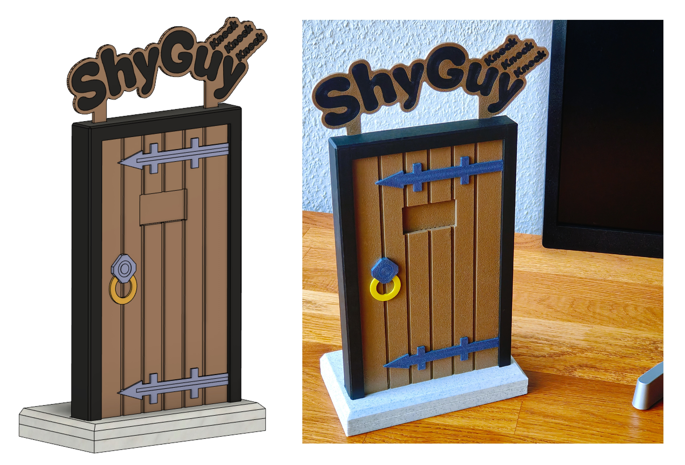

# ShyGuy
Sourcecode for ShyGuy Project Devices powered by ESP32S2 (Wemos S2 Mini)

You can download the 3D print files required for the assembly from Cults.

Device | Link
-------- | --------
ShyGuy: | <a href="https://cults3d.com/:2073182">https://cults3d.com/:2073182</a> 

 

Releases:
* V1.0 - Features:
  - Initial Release
